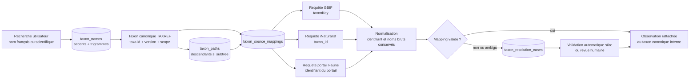

# Audit du système taxonomique

Date de l’audit : 22 juillet 2026

Périmètre : application Laravel, client Nuxt, worker Playwright Faune-France, migrations, tests et base PostgreSQL locale.

Méthode : lecture du code et requêtes SQL strictement en lecture seule. Aucun fichier applicatif, aucune migration et aucune donnée n’a été modifié pendant l’analyse ; le présent rapport est le seul fichier créé.

## 1. Synthèse

L’application possède déjà une **ébauche de taxon canonique local** : une observation pointe vers `taxa.id` et les identifiants propres à GBIF, iNaturalist et Faune-France sont rangés dans `taxon_source_mappings`. Cette séparation est saine dans son principe, mais `taxa` n’est reliée à aucun référentiel canonique. Un taxon y est actuellement identifié par son seul `scientific_name`, alimenté principalement par GBIF.

Les principales conclusions sont les suivantes :

- `taxa` est un catalogue local opportuniste, pas un miroir TAXREF ;
- `taxon_source_mappings` existe déjà, mais sa contrainte `UNIQUE (taxon_id, source)` interdit plusieurs identifiants d’une même source pour un taxon canonique ;
- la recherche `GET /api/taxa/search` a des effets de bord : elle appelle GBIF et iNaturalist puis écrit dans `taxa` et `taxon_source_mappings` ;
- la recherche locale porte uniquement sur `scientific_name`, sans noms français, synonymes, désaccentuation ni tolérance aux fautes ;
- iNaturalist ne produit pas directement les taxons retournés : il sert seulement à enrichir un résultat GBIF dont le nom scientifique correspond exactement ;
- les requêtes d’occurrences GBIF et iNaturalist repartent du nom scientifique au lieu d’utiliser les mappings déjà enregistrés ;
- la hiérarchie est une valeur JSON descriptive dans `taxa.classification`, sans relations parent/enfants ;
- un rang supérieur fonctionne côté GBIF grâce à `taxonKey`, vraisemblablement côté iNaturalist via `taxon_name`, mais les observations locales sont filtrées par égalité stricte sur `taxon_id` et n’incluent donc pas les descendants ;
- aucun statut accepté/synonyme, aucune version de référentiel et aucun mécanisme d’ambiguïté taxonomique ne sont enregistrés ;
- `faune_france_taxon_id` n’existe pas comme colonne : l’identifiant réside dans `taxon_source_mappings.source_taxon_id` avec `source = 'faune-france'`, puis devient `taxon.fauneFranceId` dans le JSON du worker ;
- les noms et identifiants bruts des observations ne sont pas tous conservés dans des colonnes explicites : l’identifiant est conservé, mais les noms restent généralement enfouis dans `observation_sources.raw_data` ;
- TAXREF est seulement mentionné dans la configuration, le `SourceRegistry`, une fixture de régression et l’audit d’API. Le registre le déclare « non utilisable actuellement » ; aucun connecteur, import, table ou version TAXREF n’est actif.

La cible recommandée est de conserver `taxa.id` comme identifiant interne stable, de l’adosser à des instantanés TAXREF versionnés, d’extraire tous les noms dans `taxon_names`, de matérialiser la hiérarchie, et d’autoriser plusieurs mappings par source vers un même taxon canonique.

## 2. Modèle de données actuel

### 2.1 Migrations

La structure taxonomique principale est créée par `database/migrations/2026_07_21_000001_create_observations_v0_tables.php`.

#### `taxa`

| Colonne | Type actuel | Rôle actuel | Limitation |
|---|---|---|---|
| `id` | bigint | Identifiant interne | Stable seulement tant que la ligne n’est pas recréée |
| `scientific_name` | varchar, unique | Clé fonctionnelle de fait | Un nom n’est pas une identité taxonomique ; homonymes et changements de nom ne sont pas représentables |
| `vernacular_name` | varchar, nullable | Un seul nom commun | Pas de langue, pays, préférence ni variantes |
| `rank` | varchar, nullable | Rang libre | Aucune contrainte ni table de vocabulaire |
| `classification` | JSON nullable | Dictionnaire rang → nom | Pas de clés étrangères, pas de parcours descendants, pas de version |
| `created_at`, `updated_at` | timestamps | Audit Laravel | Ne donnent pas la version du référentiel |

#### `taxon_source_mappings`

| Colonne | Type actuel | Rôle actuel |
|---|---|---|
| `id` | bigint | Identifiant du mapping |
| `taxon_id` | FK vers `taxa`, cascade | Taxon local cible |
| `source` | varchar(40) | `gbif`, `inaturalist`, `faune-france` |
| `source_taxon_id` | varchar(255) | Identifiant dans la source |
| `raw_data` | JSON nullable | Réponse taxonomique brute, parfois vide |
| timestamps | timestamps | Date de création/mise à jour du mapping |

Contraintes :

- `UNIQUE (source, source_taxon_id)` protège l’espace d’identifiants de chaque source ;
- `UNIQUE (taxon_id, source)` impose un seul identifiant par source pour un taxon local.

La seconde contrainte est trop restrictive. Un taxon canonique peut avoir, dans une même source, un identifiant accepté, d’anciens identifiants ou des identifiants de synonymes. Le code contourne actuellement le conflit en ignorant silencieusement les mappings supplémentaires.

#### Références à `taxa.id`

Les tables suivantes possèdent un `taxon_id` nullable :

- `observations` : rattachement canonique courant de l’observation ;
- `data_collections` : taxon sélectionné pour une collection ;
- `collection_coverages` : taxon auquel une couverture est attribuée ;
- `monitoring_rules` : taxon sélectionné pour la surveillance ;
- `import_jobs` : taxon demandé au lancement de l’import.

Toutes utilisent `nullOnDelete`. Une suppression de taxon conserve donc les objets historiques mais efface leur lien taxonomique. Aucun instantané du nom sélectionné n’est stocké dans ces tables.

#### Provenance taxonomique des observations

`observation_sources` contient :

- `source` ;
- `source_occurrence_id` ;
- `source_taxon_id` nullable ;
- `raw_data` JSON obligatoire ;
- les autres métadonnées de provenance.

Il n’existe pas de colonne explicite `source_scientific_name`, `source_vernacular_name`, `source_rank`, `taxon_source_mapping_id` ou `taxon_resolution_status`. Les noms bruts ne sont conservés que si la réponse complète dans `raw_data` les contient. Pour Faune-France, le taxon est injecté depuis la tâche et n’est pas garanti dans la réponse brute elle-même.

### 2.2 Modèles Eloquent

- `App\Models\Taxon` caste `classification` en tableau et expose seulement `mappings()`.
- `App\Models\TaxonSourceMapping` caste `raw_data` et expose `taxon()`.
- `Observation`, `DataCollection`, `MonitoringRule` et `ImportJob` exposent chacun une relation `taxon()`.
- Il n’existe aucune relation `parent`, `children`, `acceptedName`, `synonyms`, `vernacularNames` ou `referenceVersion`.

### 2.3 Seeder et état local observé

`DatabaseSeeder` crée explicitement :

- `Tichodroma muraria`, avec les mappings GBIF `2484918`, iNaturalist `14840` et Faune-France `383` ;
- `Animalia`, `Delphinus delphis`, `Vulpes vulpes` et `Papilio machaon`, sans mapping garanti hors Tichodrome.

Le reste du catalogue se remplit au fil des recherches et imports.

État de la base PostgreSQL locale constaté en lecture seule pendant l’audit :

| Mesure | Valeur |
|---|---:|
| Taxons locaux | 23 |
| Taxons avec nom vernaculaire | 1 |
| Rangs présents | 1 règne, 9 genres, 13 espèces |
| Mappings GBIF | 19 |
| Mappings iNaturalist | 1 |
| Mappings Faune-France | 1 |
| Observations | 11 |
| Observations sans taxon | 0 |
| Identifiants source observés sans mapping | 0 dans cet échantillon |
| Doublons sur `lower(trim(scientific_name))` | 0 dans cet échantillon |

Ce constat décrit uniquement la base locale au 22 juillet 2026 ; les défauts structurels restent présents même si ce petit échantillon ne contient pas encore de collision.

## 3. Recherche et sélection dans Nuxt

Il n’existe pas de composant partagé pour sélectionner un taxon. Deux implémentations indépendantes appellent le même endpoint.

### 3.1 Page d’exploration

Fichier : `front/app/pages/exploration.vue`.

- Le champ déclenche après 350 ms `GET /api/taxa/search?q=...` à partir de deux caractères.
- Le texte saisi est distinct de `taxonId` ; modifier le texte annule correctement la sélection.
- La liste affiche `scientific_name`, puis `vernacular_name` ou `rank`.
- Le choix envoie uniquement `taxon_id` aux endpoints d’estimation et d’import.
- Un champ vide représente implicitement Animalia, sans sélectionner la ligne locale `Animalia`.

Cette dernière règle crée deux sémantiques : taxon absent signifie « toutes les observations locales » et produit une requête externe `Animalia`, tandis que sélectionner le taxon local Animalia filtre localement sur son seul `taxa.id` et exclut ses descendants.

### 3.2 Nouvelle surveillance

Fichier : `front/app/pages/surveillances/nouvelle.vue`.

- La recherche est lancée au clic ou avec Entrée, sans debounce.
- La réponse attend `id`, `scientific_name`, `vernacular_name`, `rank` et `mappings`.
- Le choix envoie uniquement `taxon_id` à Laravel.
- Le frontend active Faune-France seulement si un mapping de source `faune-france` existe et si `rank === 'species'`.
- Les mappings sont donc exposés au navigateur pour piloter une capacité technique.

La logique de sélection est dupliquée avec celle de l’exploration, avec des comportements UX et des types TypeScript différents. Il n’existe ni composable taxonomique commun, ni composant accessible partagé, ni affichage de l’auteur, du rang en français, du statut accepté/synonyme ou du chemin hiérarchique.

### 3.3 Tolérance de recherche

La recherche des départements de cette page normalise les accents côté navigateur. Cette fonction n’est pas réutilisée pour les taxons. La recherche taxonomique locale est donc :

- insensible à la casse via `LOWER(...)` ;
- sensible aux accents ;
- sans correction de faute ;
- sans synonymes ;
- sans noms vernaculaires ;
- sans classement de pertinence explicite.

## 4. API taxonomique exposée au frontend

### 4.1 Endpoints

- `GET /api/taxa/search?q=...&limit=...` ;
- `GET /api/taxa/{taxon}`.

`TaxonController` renvoie directement les modèles Eloquent dans `{ "data": ... }`, avec les mappings chargés. Il n’y a pas de Resource/DTO définissant un contrat stable. La réponse de recherche contient donc actuellement les colonnes de `taxa`, les timestamps et l’ensemble des colonnes des mappings, y compris `raw_data`.

Les réponses d’observations (`GET /api/observations` et `GET /api/observations/{id}`) chargent le taxon local. Les listes de surveillances chargent aussi `taxon`. Les écrans affichent surtout le nom scientifique ou le nom vernaculaire unique.

### 4.2 Provenance des suggestions

`TaxonSearchService::search()` exécute ce flux :

1. lecture locale par `LOWER(scientific_name) LIKE '%requête%'` ;
2. appel de la recherche taxonomique GBIF ;
3. appel de la recherche taxonomique iNaturalist ;
4. parcours **des seuls résultats GBIF** ;
5. création/mise à jour de `taxa` depuis GBIF ;
6. création du mapping GBIF ;
7. ajout d’un mapping iNaturalist seulement si le nom iNaturalist est exactement égal au nom GBIF après passage en minuscules ;
8. nouvelle lecture locale sur le seul nom scientifique.

Conséquences :

- le `GET` de recherche modifie la base ;
- si GBIF échoue mais iNaturalist répond, les résultats iNaturalist ne sont ni créés ni retournés ;
- les taxons iNaturalist absents de la petite page GBIF sont perdus ;
- un nom français peut fonctionner indirectement si GBIF le comprend, mais le moteur local ne sait pas le retrouver ensuite par ce nom ;
- `vernacularNames[0]` de GBIF est retenu sans vérifier sa langue ;
- l’enrichissement iNaturalist peut fournir un nom commun non français car aucun `locale` n’est demandé ;
- `updateOrCreate` peut remplacer un nom vernaculaire existant par `null`, puis le recompléter avec le nom préféré iNaturalist ;
- deux résultats GBIF ayant le même nom mais des identifiants différents aboutissent à un seul taxon et, à cause de la contrainte actuelle, à un seul mapping GBIF ; le second est ignoré ;
- la correspondance par nom seul ne distingue pas les homonymes ni les concepts taxonomiques divergents.

## 5. GBIF et iNaturalist

### 5.1 GBIF

Fichier : `app/Services/Biodiversity/Sources/GbifConnector.php`.

Recherche de taxons :

- `GET /species/search` ;
- paramètres `q` et `limit` ;
- résultats bruts utilisés par `TaxonSearchService` ;
- seuls les rangs `species`, `genus`, `family`, `order` et `kingdom` sont admis par ce service.

Recherche d’occurrences :

- le nom local est envoyé à `GET /species/match?name=...` ;
- `usageKey` ou `speciesKey` devient le `taxonKey` de `/occurrence/search` ;
- `taxonKey` inclut les descendants côté GBIF ;
- le mapping GBIF déjà stocké n’est pas utilisé pour construire la requête ;
- la résolution n’est mise en cache que dans l’instance PHP courante.

Normalisation :

- `taxonKey`, `scientificName`, `vernacularName` et la classification sont placés dans `NormalizedOccurrence` ;
- l’identifiant devient `observation_sources.source_taxon_id` ;
- le nom sert à trouver ou créer un taxon local, mais n’est pas copié dans une colonne de provenance explicite.

### 5.2 iNaturalist

Fichier : `app/Services/Biodiversity/Sources/INaturalistConnector.php`.

Recherche de taxons :

- `GET /taxa` ;
- paramètres `q` et `per_page` ;
- résultats utilisés seulement pour enrichir les résultats GBIF par égalité du champ `name`.

Recherche d’occurrences :

- `/observations` reçoit `taxon_name`, pas le mapping `taxon_id` déjà stocké ;
- aucune résolution explicite des homonymes n’est faite ;
- les ancêtres et le rang du taxon de chaque observation sont transformés en `classification` ;
- le taxon iNaturalist et son nom préféré deviennent les valeurs normalisées.

Le code ne fixe pas de locale pour le nom vernaculaire et ne vérifie pas que le concept retourné est celui qui avait été sélectionné.

### 5.3 Identifiants différents selon les sources

Le namespace `source` évite de confondre directement `2484918` (GBIF), `14840` (iNaturalist) et `383` (Faune-France). Lorsque les noms scientifiques normalisés sont strictement identiques, ces identifiants peuvent pointer vers la même ligne `taxa`.

En revanche :

- deux synonymes écrits différemment produisent deux taxons locaux ;
- deux homonymes écrits pareil sont forcés dans un taxon local unique ;
- un taxon ne peut avoir qu’un mapping par source ;
- aucune confiance, méthode de rapprochement, validation humaine ou période de validité n’est stockée ;
- aucun identifiant TAXREF n’arbitre les désaccords.

## 6. Rattachement des observations à un taxon

Le point central est `OccurrencePersister::taxon()`.

Ordre de résolution :

1. si `(source, source_taxon_id)` existe dans `taxon_source_mappings`, utiliser son `taxon` ;
2. sinon, si le nom scientifique est absent, laisser le taxon à `null` ;
3. sinon, `firstOrCreate` une ligne par égalité exacte de `scientific_name` ;
4. déduire le rang avec la dernière clé de `classification` ;
5. créer ou mettre à jour le mapping source.

Limitations et incohérences :

- l’import demandé pour un `import_jobs.taxon_id` ne force pas les observations vers ce taxon ; chaque résultat est rerésolu indépendamment ;
- le rang dépend de l’ordre des clés du tableau de classification ;
- une ligne `taxa` déjà existante n’est pas enrichie par `firstOrCreate` ;
- lors de la mise à jour d’une provenance déjà connue, le code met à jour l’observation mais ne réexécute pas la résolution taxonomique ; une observation initialement sans taxon peut le rester ;
- lorsqu’une nouvelle provenance est rapprochée d’une observation existante par `origin_key`, son taxon résolu n’est pas appliqué à l’observation existante ;
- si deux provenances fusionnées correspondent à des taxons canoniques différents, aucune alerte de conflit taxonomique n’est créée ;
- les candidats de déduplication utilisent l’égalité de `observations.taxon_id`, donc les faux doublons taxonomiques empêchent le rapprochement et les mauvaises fusions taxonomiques peuvent le favoriser.

La table `observation_sources` conserve suffisamment de `raw_data` pour réexaminer de nombreux cas, mais pas sous une forme indexable et garantie.

## 7. Faune-France et le worker

### 7.1 Emplacement de l’identifiant

Il n’existe aucune colonne `faune_france_taxon_id`. L’identifiant est stocké comme suit :

```text
taxon_source_mappings
  source = "faune-france"
  source_taxon_id = "383"
```

Ce choix générique est préférable à une colonne dédiée, sous réserve de faire évoluer la table de mappings.

### 7.2 Construction de la tâche Laravel

`MonitoringSynchronizer` :

1. prend le `taxon_id` de la surveillance ;
2. charge son mapping `source = 'faune-france'` ;
3. crée `external_fetch_jobs.payload` avec :
   - `fauneFranceId` depuis `source_taxon_id` ;
   - `scientificName` et `vernacularName` depuis `taxa` ;
   - `rank` forcé à `species` ;
   - dates, départements, pagination et pause.

Laravel refuse Faune-France si le taxon n’a pas de mapping, si son rang n’est pas exactement `species`, si la zone n’est pas une sélection de départements métropolitains ou si plusieurs portails Faune sont impliqués.

### 7.3 Validation et utilisation par le bot

`bot/src/job.ts` exige strictement :

```json
{
  "taxon": {
    "fauneFranceId": "383",
    "scientificName": "Tichodroma muraria",
    "vernacularName": "Tichodrome échelette",
    "rank": "species"
  }
}
```

Le bot refuse tout autre rang et envoie :

- `sp_SChoice=species` ;
- `sp_S=<fauneFranceId>`.

Le worker ne résout aucun nom. Il fait confiance au payload Laravel. À la réception des résultats, `FauneFranceRawObservationNormalizer` réinjecte ce même taxon dans chaque observation brute, puis `OccurrencePersister` utilise le mapping `faune-france`.

Les futurs portails (`faune_antilles`, `faune_guyane`, `faune_reunion`, `faune_mayotte`) n’ont actuellement ni session, ni mappings, ni connecteur. Ils ne doivent pas partager implicitement l’espace d’identifiants de Faune-France.

## 8. Rangs, noms et synonymes actuels

### 8.1 Rangs

La base accepte techniquement n’importe quelle chaîne ou `null`. Il n’existe aucune validation générale des sept rangs demandés.

| Rang fonctionnel | Code actuel attendu | Recherche GBIF → création locale | Requête d’occurrences | Faune-France |
|---|---|---:|---|---:|
| Règne | `kingdom` | oui | GBIF descendants ; iNat par nom | non |
| Embranchement | `phylum` | non, filtré par `TaxonSearchService` | connecteurs techniquement génériques | non |
| Classe | `class` | non, filtré par `TaxonSearchService` | connecteurs techniquement génériques | non |
| Ordre | `order` | oui | connecteurs génériques | non |
| Famille | `family` | oui | connecteurs génériques | non |
| Genre | `genus` | oui | connecteurs génériques | non |
| Espèce | `species` | oui | oui | oui uniquement |

Même lorsque la source externe inclut les descendants, `LocalObservationQuery` et `ObservationController` filtrent par `observations.taxon_id = taxon sélectionné`. Les descendants locaux ne sont donc jamais inclus.

### 8.2 Noms

- Nom scientifique : un champ unique par taxon, utilisé comme identité de fait.
- Nom français/vernaculaire : un seul champ non localisé, souvent absent et potentiellement non français.
- Synonymes : aucune table, aucun champ, aucun statut.
- Nom accepté : aucune notion distincte du `scientific_name` courant.
- Auteur et année : non stockés.
- Homonymes : non représentables proprement.

## 9. Vérification des capacités demandées

| Capacité | État | Détail |
|---|---|---|
| Notion de taxon canonique | Partielle | `taxa.id` joue ce rôle dans l’application, sans autorité TAXREF ni statut nomenclatural |
| Table de correspondances par source | Oui, limitée | `taxon_source_mappings`, un seul ID par source et taxon |
| Hiérarchie parent/enfants | Non | Seulement un JSON `classification` dénormalisé |
| Nom accepté ou synonyme | Non | Aucun statut ni relation |
| Recherche tolérante aux accents | Non pour les taxons | Présente uniquement pour le sélecteur de départements côté Nuxt |
| Recherche tolérante aux fautes | Non | Pas de trigrammes, distance ni suggestions |
| Version du référentiel | Non | Seulement une URL TAXREF en configuration et des notes d’audit |
| Conservation de l’identifiant brut source | Oui | `observation_sources.source_taxon_id` |
| Conservation explicite du nom brut source | Non | Généralement seulement dans `raw_data` |
| Gestion des taxons ambigus/non résolus | Non | Création par nom ou `taxon_id = null`, sans file de validation |

## 10. Risques prioritaires

1. **Fusion incorrecte d’homonymes** : `scientific_name` unique force un concept unique.
2. **Éclatement des synonymes** : des noms différents créent plusieurs taxons pour un même concept.
3. **Recherche GET mutante** : une simple saisie utilisateur modifie le référentiel local avec des données externes non validées.
4. **Mappings incomplets** : un seul identifiant autorisé par source et taxon ; les conflits sont parfois ignorés silencieusement.
5. **Rang supérieur incohérent** : résultats externes descendants, résultats locaux exacts.
6. **Identifiants source non utilisés lors des requêtes** : GBIF et iNaturalist sont rerésolus depuis le nom.
7. **Noms français fragiles** : langue inconnue, un seul champ, recherche locale impossible.
8. **Perte de reproductibilité** : aucune version taxonomique attachée aux surveillances, imports ou observations.
9. **Conflits lors de la fusion d’observations** : aucune règle si deux sources pointent vers deux taxons locaux.
10. **Contrat API instable et surchargé** : modèles Eloquent et `raw_data` des mappings directement exposés.

## 11. Architecture cible TAXREF

### 11.1 Principes

- `taxa.id` reste l’identifiant canonique interne stable utilisé par l’application.
- TAXREF fournit le concept accepté, les synonymes, les rangs et la hiérarchie pour la France.
- Un import TAXREF est versionné et reproductible ; aucune mise à jour ne remplace silencieusement l’historique.
- Les noms et identifiants des sources restent des faits de provenance, distincts de la détermination canonique.
- Une correspondance automatique incertaine ne crée pas une vérité canonique : elle ouvre un cas de résolution.
- Les requêtes externes utilisent les identifiants source validés lorsqu’ils existent.
- Les sélections de rang supérieur ont une sémantique explicite `exact` ou `subtree`.

### 11.2 Tables proposées

#### `taxonomic_reference_versions`

| Colonne | Type proposé | Contraintes/usage |
|---|---|---|
| `id` | bigint PK | Identifiant interne |
| `provider` | varchar(40) | `taxref` |
| `version` | varchar(80) | Unique avec `provider` |
| `published_on` | date nullable | Date officielle |
| `source_uri` | text | Origine du fichier |
| `sha256` | char(64) | Contrôle d’intégrité |
| `status` | varchar(20) | `staging`, `active`, `archived`, `failed` |
| `imported_at` | timestamptz nullable | Fin d’import |
| `metadata` | jsonb | Licence, colonnes, statistiques |
| timestamps | timestamptz | Audit |

Index : unique `(provider, version)`, unique partiel sur `provider WHERE status = 'active'`, index `(status, imported_at)`.

#### `taxon_ranks`

| Colonne | Type proposé | Usage |
|---|---|---|
| `code` | varchar(30) PK | `kingdom`, `phylum`, `class`, `order`, `family`, `genus`, `species` |
| `label_fr` | varchar(80) | Règne, embranchement, classe, ordre, famille, genre, espèce |
| `sort_order` | smallint unique | Ordre hiérarchique |
| `selectable` | boolean | Vrai pour les sept rangs initiaux |
| `taxref_rank_codes` | text[] | Codes TAXREF correspondants |

Une table est préférable à un enum PostgreSQL afin d’ajouter ultérieurement sous-espèce ou infra-rang sans migration de type.

#### `taxa`

Table canonique stable, ne contenant qu’un concept accepté ou un concept interne explicitement validé.

| Colonne | Type proposé | Contraintes/usage |
|---|---|---|
| `id` | bigint PK | Identifiant canonique interne stable |
| `taxref_version_id` | FK nullable | Version courante qui décrit le taxon |
| `taxref_cd_ref` | bigint nullable | Identifiant accepté TAXREF courant |
| `rank_code` | FK vers `taxon_ranks` | Rang contrôlé |
| `parent_id` | FK auto-référente nullable | Parent courant |
| `accepted_scientific_name` | varchar(512) | Nom accepté courant |
| `authorship` | varchar(512) nullable | Auteur/année |
| `preferred_french_name` | varchar(512) nullable | Cache d’affichage, dérivé de `taxon_names` |
| `status` | varchar(20) | `active`, `retired`, `merged` |
| `merged_into_taxon_id` | FK nullable | Redirection d’un ancien concept interne |
| `current_taxref_record_id` | FK différée nullable | Enregistrement TAXREF accepté courant |
| timestamps | timestamptz | Audit |

Contraintes : unique `(taxref_version_id, taxref_cd_ref)` lorsque `taxref_cd_ref` n’est pas nul ; interdiction de se fusionner vers soi-même ; cohérence entre `status` et `merged_into_taxon_id`.

#### `taxref_records`

Miroir versionné des lignes TAXREF, accepté ou synonyme.

| Colonne | Type proposé | Usage |
|---|---|---|
| `id` | bigint PK | Identifiant interne de l’instantané |
| `taxonomic_reference_version_id` | FK | Version TAXREF |
| `taxon_id` | FK nullable pendant staging | Concept canonique résolu |
| `cd_nom` | bigint | Identifiant du nom TAXREF |
| `cd_ref` | bigint | Identifiant du nom accepté TAXREF |
| `parent_cd_ref` | bigint nullable | Parent fourni par TAXREF |
| `scientific_name` | varchar(512) | Nom source |
| `authorship` | varchar(512) nullable | Auteur source |
| `rank_code` | FK nullable | Rang normalisé |
| `name_status` | varchar(30) | `accepted`, `synonym`, autre statut source |
| `raw_data` | jsonb | Ligne source intégrale |

Index : unique `(taxonomic_reference_version_id, cd_nom)`, btree `(taxonomic_reference_version_id, cd_ref)`, `(taxonomic_reference_version_id, parent_cd_ref)`, `(taxon_id)`, GIN sur `raw_data` uniquement si des usages réels le justifient.

#### `taxon_names`

| Colonne | Type proposé | Usage |
|---|---|---|
| `id` | bigint PK | Identifiant du nom |
| `taxon_id` | FK cascade | Concept canonique |
| `taxonomic_reference_version_id` | FK nullable | Provenance/version |
| `taxref_record_id` | FK nullable | Ligne TAXREF d’origine |
| `name` | varchar(512) | Forme affichée |
| `normalized_name` | varchar(512) | Minuscules, accents retirés, espaces normalisés |
| `name_type` | varchar(30) | `accepted_scientific`, `scientific_synonym`, `vernacular` |
| `language_code` | varchar(12) nullable | `fr`, `la`, etc. |
| `authorship` | varchar(512) nullable | Auteur pour les noms scientifiques |
| `is_preferred` | boolean | Nom préféré par langue/type |
| `source` | varchar(40) | `taxref`, validation locale, autre |
| timestamps | timestamptz | Audit |

Contraintes : unicité logique `(taxon_id, taxonomic_reference_version_id, name_type, language_code, normalized_name)` avec gestion explicite des `NULL`. Un seul nom préféré par `(taxon_id, name_type, language_code)` via index unique partiel.

#### `taxon_paths`

Table de fermeture pour les recherches de descendants et la reproductibilité par version.

| Colonne | Type proposé | Usage |
|---|---|---|
| `taxonomic_reference_version_id` | FK | Version de la hiérarchie |
| `ancestor_taxon_id` | FK | Ancêtre |
| `descendant_taxon_id` | FK | Descendant, lui-même inclus à profondeur 0 |
| `depth` | integer | Distance hiérarchique |

Clé primaire `(taxonomic_reference_version_id, ancestor_taxon_id, descendant_taxon_id)`. Index `(taxonomic_reference_version_id, descendant_taxon_id, depth)` pour les remontées et `(taxonomic_reference_version_id, ancestor_taxon_id, depth)` pour les sous-arbres.

#### `taxon_source_mappings` remaniée

| Colonne | Type proposé | Usage |
|---|---|---|
| `id` | bigint PK | Mapping auditable |
| `taxon_id` | FK | Taxon canonique |
| `source` | varchar(40) | `gbif`, `inaturalist`, `faune_france`, `faune_antilles`, `faune_guyane`, `faune_reunion`, `faune_mayotte` |
| `source_taxon_id` | varchar(255) | Identifiant source |
| `source_accepted_taxon_id` | varchar(255) nullable | Identifiant accepté éventuel dans la source |
| `source_scientific_name` | varchar(512) nullable | Nom brut du mapping |
| `source_rank` | varchar(80) nullable | Rang brut |
| `source_reference_version` | varchar(120) nullable | Backbone/version source si disponible |
| `mapping_status` | varchar(30) | `validated`, `candidate`, `deprecated`, `rejected` |
| `match_type` | varchar(30) | `identifier`, `exact_name`, `synonym`, `manual` |
| `confidence` | numeric(5,4) nullable | Score documentaire, pas une validation à lui seul |
| `is_preferred` | boolean | Mapping à utiliser pour les requêtes |
| `valid_from`, `valid_to` | timestamptz nullable | Historique |
| `reviewed_at`, `reviewed_by` | audit nullable | Validation humaine |
| `raw_data` | jsonb | Réponse source |
| timestamps | timestamptz | Audit |

Supprimer `UNIQUE (taxon_id, source)`. Conserver une unicité sur l’identité source, par exemple `(source, source_taxon_id, source_reference_version)` avec `NULLS NOT DISTINCT`, et un index unique partiel garantissant un seul mapping préféré actif par `(taxon_id, source)` si la politique l’exige. Plusieurs mappings non préférés restent autorisés.

Les codes de source doivent être normalisés pendant la migration. Le code courant utilise `faune-france` tandis que la cible ci-dessus propose `faune_france` pour rester cohérente avec les autres portails. Il faut choisir une convention unique, migrer les FK/valeurs et garder une traduction temporaire aux frontières API ; les deux formes ne doivent pas coexister durablement.

#### `taxon_resolution_cases` et `taxon_resolution_candidates`

`taxon_resolution_cases` reçoit tout taxon source non résolu ou ambigu : source, identifiant, nom scientifique brut, nom vernaculaire brut, rang, classification JSONB, statut (`pending`, `resolved`, `ignored`), taxon finalement retenu, méthode, note, première/dernière occurrence et compteur d’occurrences.

`taxon_resolution_candidates` relie un cas à plusieurs `taxa` avec un score et des raisons JSONB. Clé unique `(taxon_resolution_case_id, taxon_id)`, index des cas `pending`, index `(source, source_taxon_id)` et trigramme sur le nom normalisé.

Ces tables évitent de créer automatiquement une ligne canonique à partir d’un nom douteux.

### 11.3 Adaptations des tables métier

#### `observation_sources`

Ajouter :

- `source_scientific_name` ;
- `source_vernacular_name` ;
- `source_rank` ;
- `resolved_taxon_id` nullable ;
- `taxon_source_mapping_id` nullable ;
- `taxon_resolution_case_id` nullable.

Conserver `source_taxon_id` et `raw_data`. `observations.taxon_id` reste le taxon canonique de consensus. Si deux provenances résolues sont en conflit, ne pas écraser silencieusement : ouvrir un cas et conserver toutes les valeurs sources.

#### Surveillances, collections, couvertures et imports

Ajouter à `monitoring_rules`, `data_collections` et `import_jobs` :

- `taxon_reference_version_id` ;
- `taxon_scope` avec `exact` ou `subtree` ;
- éventuellement un instantané `taxon_label_snapshot` pour l’affichage historique.

`collection_coverages` doit également inclure la version et le scope, faute de quoi une couverture calculée avant une évolution de hiérarchie pourrait être réutilisée avec un autre ensemble de descendants.

Pour les tâches Faune, ajouter des FK explicites `taxon_id` et `taxon_source_mapping_id` à `external_fetch_jobs`, tout en conservant le payload immuable nécessaire au worker.

### 11.4 Index PostgreSQL de recherche

Activer `pg_trgm` et `unaccent`. Comme `unaccent()` n’est pas immuable par défaut, remplir `taxon_names.normalized_name` pendant l’import ou via une fonction immuable maîtrisée, plutôt que de supposer un index fonctionnel fragile.

Index recommandés :

```sql
CREATE INDEX taxon_names_normalized_trgm
  ON taxon_names USING gin (normalized_name gin_trgm_ops);

CREATE INDEX taxon_names_normalized_prefix
  ON taxon_names (normalized_name text_pattern_ops);

CREATE INDEX taxon_names_taxon_type_language
  ON taxon_names (taxon_id, name_type, language_code);

CREATE INDEX taxa_parent_id ON taxa (parent_id);
CREATE INDEX taxa_rank_status ON taxa (rank_code, status);

CREATE INDEX mappings_taxon_source_active
  ON taxon_source_mappings (taxon_id, source)
  WHERE mapping_status = 'validated' AND valid_to IS NULL;

CREATE INDEX mappings_source_lookup
  ON taxon_source_mappings (source, source_taxon_id);

CREATE INDEX observations_taxon_observed_at
  ON observations (taxon_id, observed_at DESC);

CREATE INDEX observation_sources_resolved_taxon
  ON observation_sources (resolved_taxon_id);
```

La recherche doit classer, dans cet ordre approximatif : nom accepté exact, nom français préféré exact, synonyme exact, préfixe, similarité trigramme. Elle doit retourner le taxon canonique, le nom ayant correspondu, son type, le rang en français et une courte lignée pour désambiguïser.

## 12. Flux cible



Pour un rang supérieur, le planificateur doit d’abord essayer un mapping source du taxon parent lorsque la source garantit l’inclusion des descendants. Sinon, il doit développer le sous-arbre TAXREF, traduire les descendants vers les mappings de cette source, grouper les requêtes et consigner le plan réellement utilisé.

## 13. Contrat API cible

La recherche frontend ne doit plus appeler directement les API externes ni écrire en base. Exemple de résultat :

```json
{
  "id": 123,
  "acceptedScientificName": "Tichodroma muraria",
  "preferredFrenchName": "Tichodrome échelette",
  "matchedName": "tichodrome echelette",
  "matchedNameType": "vernacular",
  "rank": { "code": "species", "label": "Espèce" },
  "lineage": ["Animalia", "Chordata", "Aves", "Passeriformes", "Tichodromidae"],
  "reference": { "provider": "TAXREF", "version": "…", "cdRef": 0 },
  "sourceAvailability": {
    "gbif": true,
    "inaturalist": true,
    "faune_france": true
  }
}
```

Les mappings complets et leur `raw_data` ne doivent pas être exposés au frontend. Un champ de capacités calculé côté Laravel suffit.

## 14. Stratégie de migration proposée

Cette section est une proposition ; aucune étape n’est exécutée par cet audit.

### Phase 0 — décisions et sauvegarde

1. Choisir la version TAXREF de départ et vérifier ses conditions de diffusion.
2. Décider si les sept rangs sont les seuls sélectionnables tout en important les rangs intermédiaires nécessaires à la hiérarchie.
3. Sauvegarder PostgreSQL et mesurer les volumes réels.
4. Geler temporairement les écritures taxonomiques implicites de `GET /taxa/search` au moment de la bascule.

### Phase 1 — schéma additif

1. Créer `taxonomic_reference_versions`, `taxon_ranks`, `taxref_records`, `taxon_names`, `taxon_paths` et les tables de résolution.
2. Ajouter les nouvelles colonnes nullable à `taxa`, `observation_sources`, surveillances, collections et imports.
3. Remanier `taxon_source_mappings` sans supprimer encore les anciennes contraintes avant contrôle des données.
4. Créer les extensions et index hors transaction ou avec `CONCURRENTLY` selon le volume.

### Phase 2 — import TAXREF en staging

1. Charger le fichier officiel dans `taxref_records` sous une version `staging`.
2. Valider nombre de lignes, unicité des `cd_nom`, références `cd_ref`, parents, rangs et checksum.
3. Construire les taxons acceptés, noms, synonymes, vernaculaires et chemins hiérarchiques.
4. Ne passer la version à `active` qu’après validation complète.

### Phase 3 — rapprochement des 23 taxons actuels

Pour chaque ligne existante :

1. utiliser d’abord les mappings validés GBIF/iNaturalist et les éventuels crosswalks officiels ;
2. essayer le nom scientifique exact avec rang et lignée ;
3. utiliser les synonymes TAXREF ;
4. créer un cas de résolution si plusieurs candidats subsistent ;
5. préserver `taxa.id` lorsque le concept est confirmé ;
6. ne jamais fusionner deux lignes automatiquement sur la seule similarité textuelle.

Un tableau de correspondance temporaire `old_taxon_id → canonical_taxon_id` permettra de mettre à jour les FK. Les 23 lignes et 11 observations rendent une revue manuelle réaliste dans l’état actuel.

### Phase 4 — provenance et observations historiques

1. Extraire `source_taxon_id`, nom, rang et classification depuis chaque `raw_data` lorsque disponibles.
2. Remplir les nouvelles colonnes de `observation_sources` sans modifier le JSON brut.
3. Lier chaque provenance à un mapping validé ou à un cas de résolution.
4. Recalculer `observations.taxon_id` seulement lorsque toutes les provenances résolues sont cohérentes.
5. Signaler les conflits ; ne pas écraser automatiquement un taxon historique.
6. Réévaluer les candidats de déduplication affectés par les fusions taxonomiques validées.

### Phase 5 — surveillances et collections

1. Associer chaque règle/collection/import à la version TAXREF active au moment de sa migration.
2. Définir `taxon_scope = exact` pour reproduire le comportement local historique, sauf choix explicite et validé de passer à `subtree`.
3. Pour les surveillances manifestement créées sur un rang supérieur avec intention de clade, proposer une conversion contrôlée vers `subtree`.
4. Invalider ou recalculer les couvertures dont le scope ou la version change.
5. Conserver le libellé historique pour les taxons retirés ou fusionnés.

### Phase 6 — connecteurs et API

1. Remplacer `/species/match` GBIF par le mapping GBIF validé lorsque disponible.
2. Utiliser `taxon_id` iNaturalist plutôt que `taxon_name`.
3. Résoudre le mapping du portail Faune approprié sans réutiliser l’identifiant métropolitain ailleurs.
4. Refuser ou mettre en attente une requête dont le mapping est ambigu.
5. Remplacer la recherche mutante par une recherche PostgreSQL locale versionnée.
6. Introduire un DTO API et un composant Nuxt unique de sélection.

### Phase 7 — contraintes finales

Après backfill et validation :

- rendre non nulles les colonnes garanties ;
- retirer l’unicité de `taxa.scientific_name` ;
- retirer `UNIQUE (taxon_id, source)` ;
- ajouter les nouvelles contraintes uniques et checks ;
- conserver temporairement `scientific_name`, `vernacular_name` et `classification` comme colonnes de compatibilité, puis les déprécier après migration du code ;
- documenter la procédure de rollback par version TAXREF.

## 15. Mise à jour future de TAXREF

Chaque nouvelle version doit être importée parallèlement en `staging`, jamais par remplacement direct. Le processus doit produire un rapport : concepts inchangés, noms modifiés, synonymes ajoutés, changements de parent/rang, `cd_ref` remplacés, taxons retirés et cas ambigus.

Les `taxa.id` internes restent stables lorsque le concept reste le même. En cas de fusion ou séparation TAXREF :

- une fusion utilise `status = merged` et `merged_into_taxon_id`, sans supprimer l’ancien ID ;
- une séparation crée de nouveaux taxons et ouvre des cas de résolution pour les observations historiques impossibles à attribuer automatiquement ;
- les surveillances peuvent suivre la version courante après validation, tandis que les collections et couvertures historiques conservent leur version d’exécution ;
- un journal de migration doit enregistrer l’ancienne et la nouvelle référence, la méthode et la décision humaine éventuelle.

## 16. Conséquences fonctionnelles

### Surveillances

- Un taxon choisi reste stable même si son nom accepté change.
- Le scope `subtree` rend enfin cohérentes les surveillances de règne, embranchement, classe, ordre, famille et genre.
- La disponibilité de chaque source dépend d’un mapping validé et des capacités du connecteur.
- Une évolution TAXREF doit déclencher une revue du plan de requête, pas une modification silencieuse.

### Collections historiques

- Elles doivent conserver version, scope et libellé de sélection.
- Leur couverture ne peut pas être réutilisée si la définition taxonomique a changé.
- Les liens vers les observations restent valides grâce aux IDs internes stables et aux redirections de taxons fusionnés.

### Observations existantes

- Les données brutes restent inchangées.
- Les identifiants et noms source deviennent explicites et interrogeables.
- Les rattachements sûrs sont migrés ; les autres deviennent des cas de résolution.
- Une observation multisource ne doit être canonisée que si les mappings convergent ou après validation.

## 17. Conclusion

Le projet dispose des bons points d’ancrage — `taxa.id`, `observations.taxon_id`, `observation_sources.source_taxon_id` et une table de mappings — mais le catalogue actuel confond encore **nom scientifique**, **concept canonique** et **résolution de source**. TAXREF doit devenir l’autorité locale versionnée, tandis que GBIF, iNaturalist et chaque portail Faune restent des namespaces externes reliés par des mappings auditables.

La priorité de migration est : importer un TAXREF versionné, rendre les noms et la hiérarchie interrogeables, rapprocher le petit catalogue existant avec revue des ambiguïtés, puis seulement basculer la recherche et les connecteurs vers les identifiants validés.
